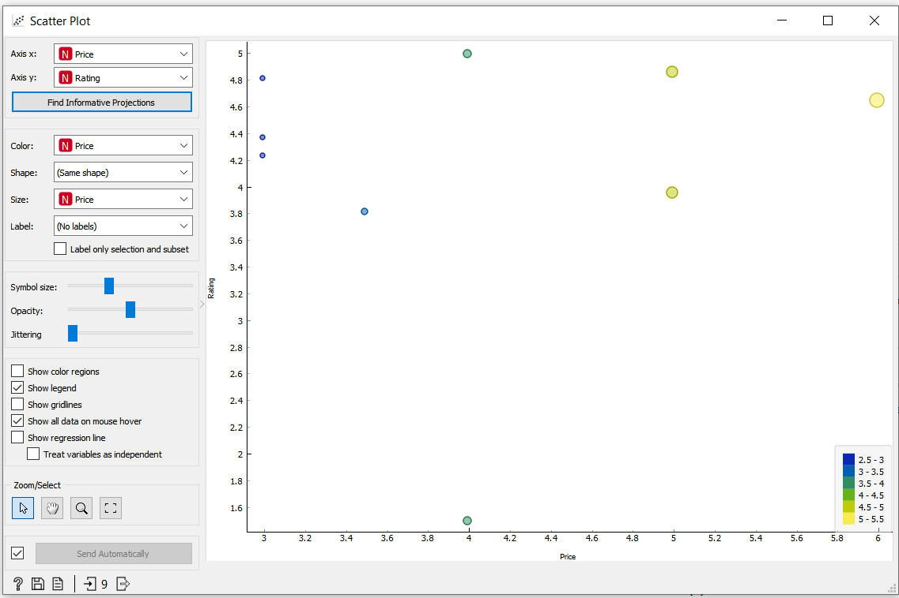

# INF331---CarolAugusti

# Equipe
* Caroline Augusti

# Projeto Orange / Regras de Associação para Foodmart

Para realizar o processo de recomendações, foi utilizado o "Select Rows" para filtrar os produtos comprados pelo cliente, e através dos recursos de "Association Rules" e "Frequent Itemsets", os dados podem ser analisados e manipulados para gerar as recomendações.

## Imagem do Projeto

## Arquivo do Projeto
> [Tarefa 01 - Foodmart](orange/Foodmart.ows)

# Projeto Orange / Análise de Dados do Google PlayStore

Para estudar melhor a estrutura do software Orange quanto a geração de gráficos, foi apresentado 3 gráficos de análise dos dados.

Os gráficos "Scatter Plot" comparam os aplicativos pagos e grátis da categoria de "Food_and_Drink" do database. Enquanto, o gráfico de distribuição relaciona as instalações dos aplicativos pagos de acordo com o público alvo de cada aplicativo.

## Imagem do Projeto

## Arquivo do Projeto
> [Tarefa 02 - Google PlayStore](orange/Google_PlayStore.ows)

## Gráfico(s) de Análise

# Projeto de Composição de Componentes para Recomendação

## Diagrama de Componentes

## Arquivo do Projeto
> [Tarefa 03 - Recomendação](orange/Aula01_Tarefa03.asta)

# Projeto de Composição de Componentes para Pedido

## Diagrama de Componentes

## Diagrama de Interfaces

## Arquivo do Projeto
> [Tarefa 04 - Pedido](orange/Aula01_Tarefa04.asta)
