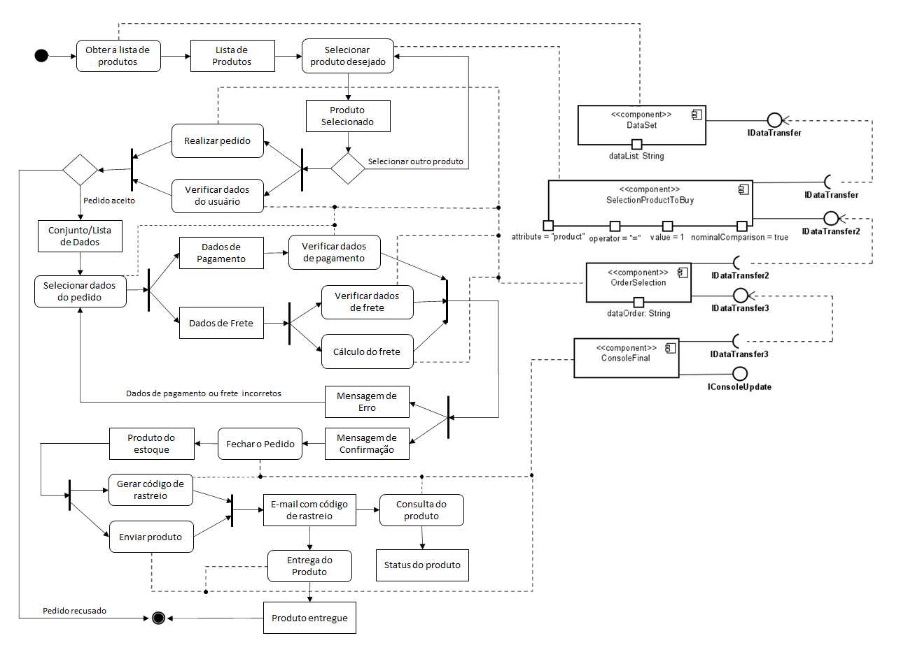
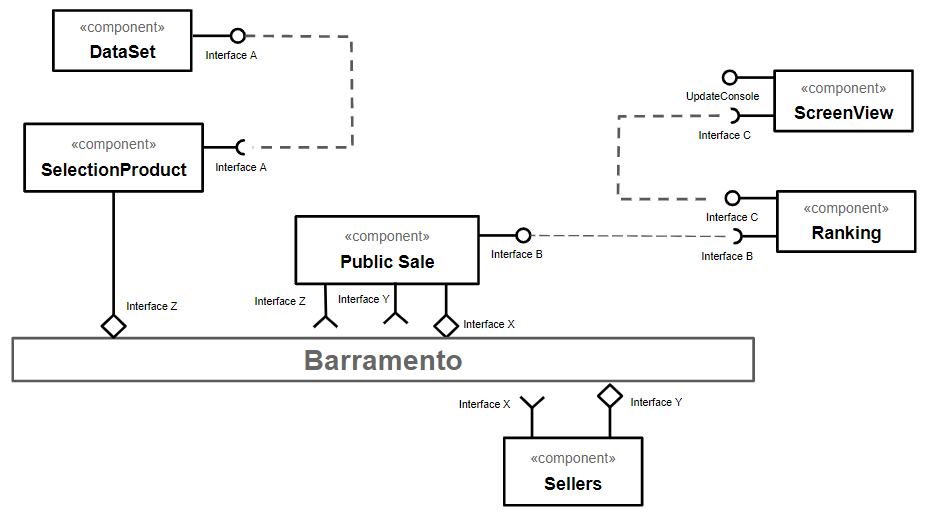
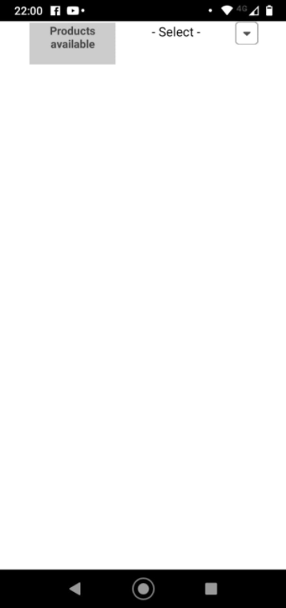
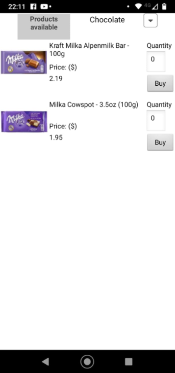
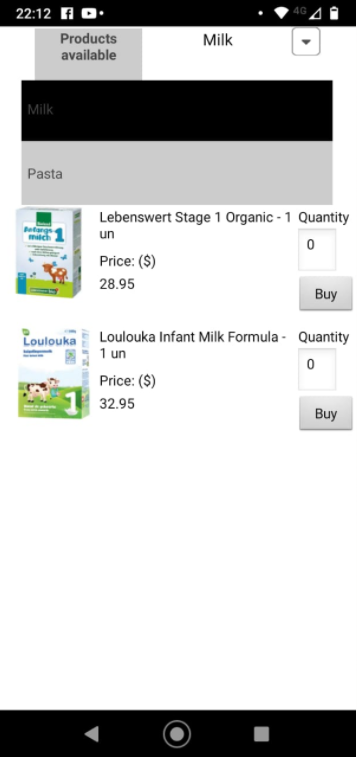
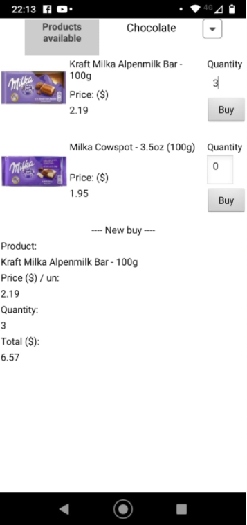
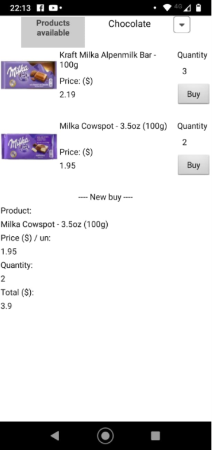
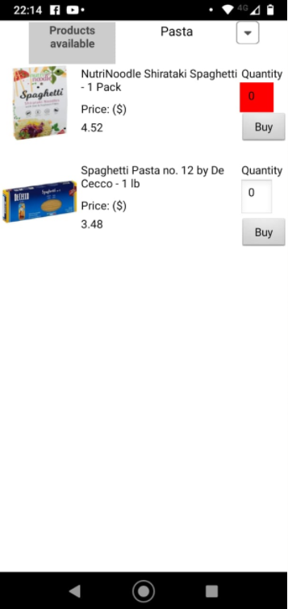

# INF331---CarolAugusti

## Tarefa 1
 
 

## Tarefa 2
 

> Descrição do diagrama apresentado acima.

> 1. O componente "DataSet" irá gerar a lista de produtos disponíveis.

> 2. O componente "SelectionProduct" irá solicitar a lista de produtos através da interface A. Ele irá filtrar pelo produto desejado para leilão, e enviá-lo através da interface Z para o barramento.

> 3. O componente "Public Sale" irá aceitar apenas produtos de interesse para seu leilão, através da interface Z. 
> Em seguida, ele irá disponibilizar o produto em questão no barramento para os sellers interessados (através da interface X).
> E finalmente, após o encerramento dos lances, o componente irá capturar a lista dos valores leiloados no barramento, através da interface Y.

> 4. O componente "Sellers" irá aceitar apenas os produtos de interesse para seus vendedores, através da interface X.
> Após os lances terem sido realizados, o componente irá enviar a lista dos valores leiloados para o barramento (através da interface Y).

> 5. O componente "Ranking" irá solicitar a lista dos valores leiloados através da interface B, e ranquear pelos três menores preços do produto. Sendo que em caso de empate, o componente irá considerar quem fez a primeira oferta.

> 6. O componente "ScreenView" irá solicitar o ranking através da interface C e exibir para o usuário.

## Tarefa 3

> Tela 01 - Tela inicial sem nenhum produto selecionado

> Tela 02 - Tela do primeiro produto selecionado.

> Tela 03 - Tela do segundo produto selecionado (junto da barra de seleção em "Milk").

> Tela 04 - Tela da primeira compra realizada na parte inferior da página.

> Tela 04.01 - Tela da segunda compra realizada na parte inferior da página.

> Tela 04.02 - Caso a quantidade não tenha sido inserida, o sistema não irá exibir a compra e irá destacar o campo errado.

> Tela 05 - Tela do Diagrama de Blocos do Aplicativo

> Aplicativo (formato .aia)

[Aplicativo da Tarefa](app/Tarefa03_App.aia)

