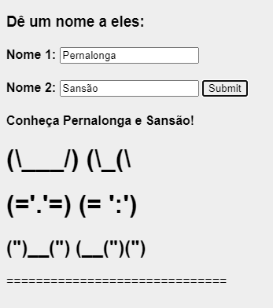

# INF331---CarolAugusti

## Tarefa 1
> 
> 

## Tarefa 2
Link para o projeto no Codepen: [Tarefa React - Componente Nomeie os Coelhos](https://codepen.io/caugusti/pen/wvGPeoQ)

> Código do componente:
>
**HTML**
~~~html
<form method="GET">
  <h3>Dê um nome a eles:</h3>
  <h4>Nome 1: <input type="text" size="20" id="name1"   />
  <input type="text" style="display: none;" /></h4>
  <h4>Nome 2: <input type="text" size="20" id="name2"   />
  <input type="text" style="display: none;" /> <button type="button" id="button">Submit</button></h4>
</form>

~~~

CSS
~~~css
body {
  font-size:1em;
  font-family:Arial;
  background:#eee;
}

#hellomessage {
  font-weight:bold;
}
~~~

**JavaScript**
~~~javascript
class Barra extends React.Component {
  render() {
    let resultado = "";
    for (let b = 1; b <= this.props.tamanho; b++)
      resultado += "=";
    return resultado;
  }
}

function ShowMessage() {
    var name1 = document.getElementById("name1");
    var name2 = document.getElementById("name2");
  
    if (name1.value == "" || name2.value == "")
    {
      document.getElementById("hellomessage").innerHTML = "Insira o nome dos dois coelhos!"
    } else {
       document.getElementById("hellomessage").innerHTML = "Conheça " + name1.value + " e " + name2.value + "!";
    }
}

document.getElementById("button").onclick = ShowMessage;

const elemento = 

                   <h1>(\___/)  (\_(\</h1>
                   <h1>(='.'=)  (= ':')</h1>
                   <h2>(")__(")  (__(")(")</h2>
                   <Barra tamanho="30"/>
                 

ReactDOM.render(elemento, 
        document.getElementById("root"));

document.getElementById("button").onclick = ShowMessage;
~~~

> 